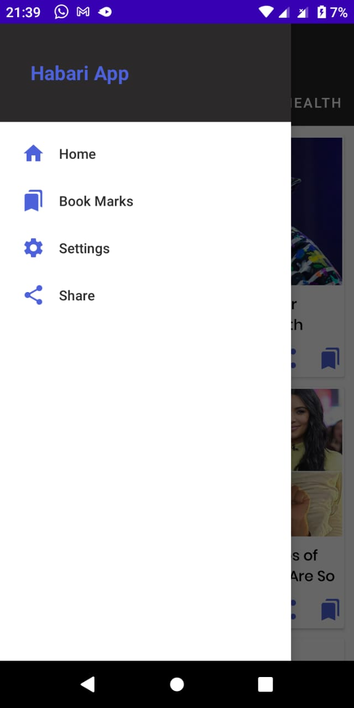
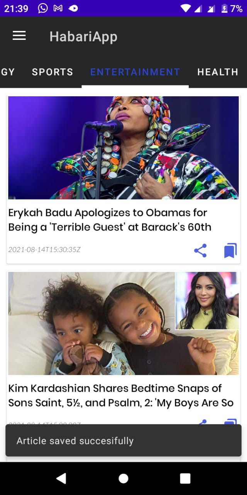
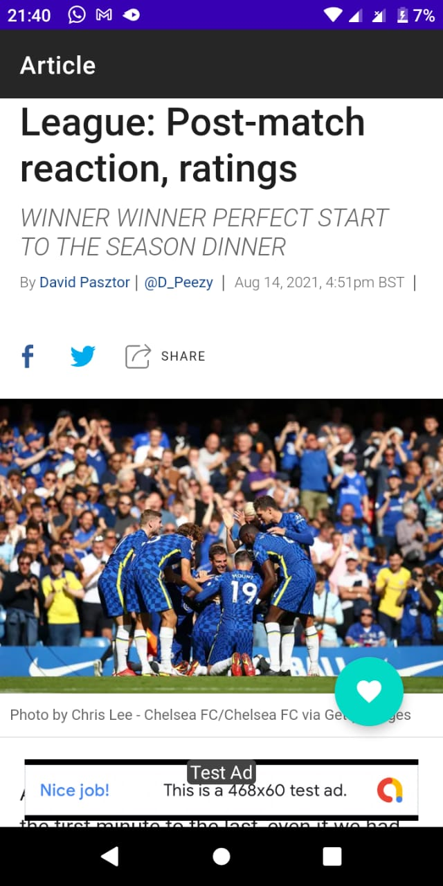
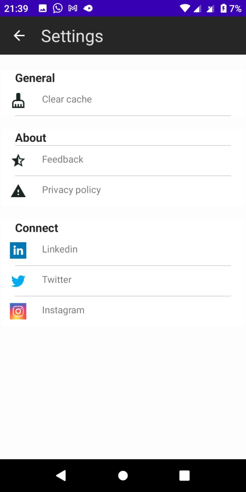

# HabariApp
-A MVVM based android news app that consumes newsapi.org and lists news according to different categories.

&nbsp;
&nbsp;

# HabariApp  🛠️Work In Progress🛠

 An android app built using Kotlin that consumes [newsapi.org]("https://newsapi.org/") to display breaking, sports, entertainment, health and technology news. It has been built following  MVVM Architecture as well as jetpack components.

 I created this repository for the following reasons:
 1. To learn the approch of implementing [MVVM architecture](https://developer.android.com/jetpack/guide?gclid=CjwKCAjwsNiIBhBdEiwAJK4khhpsQHFFQMqZe70R-gPM64r9D5lvqAtniIFZY9PvtqxNz7eDn2bTTRoCLgYQAvD_BwE&gclsrc=aw.ds) in an android app.
 2. To learn libraries/tools supported by Google and most of the android development communities.
 3. To consume rest api using the best practice.
 4. Demonstrate best developement practices by utilizing up to date tech-stack .

## Table Of Content

- [Prerequisite](#prerequisite)
- [Architecture](#architecture)
    - [What is MVVM Architecture](##why-clean-architecture)
    -     
- [Tech Stack](#techstack)
    - [Patterns](#patterns)
    - [Libraries](#libraries)
    - [Plugins](#plugins)
- [Related Posts](#related-posts)
- [Demo](#demo)
- [Work In Progress](#work-in-progress)

## Prerequisite.

In order to be able to build the application you'll need to change the value of API_KEY in app/utils/constants). First you need to generate your own api key by [creating]("https://newsapi.org/") an newasapi.org account and generating the api key.

## Architecture.

### What is MVVM Architecture?

A well planned architecture is extremely important for an app to scale and all architectures have one common goal- to manage complexity of your app.

Model–view–viewmodel (MVVM) is a software architectural pattern that facilitates the separation of the development of the graphical user interface (the view) – be it via a markup language or GUI code – from the development of the business logic or back-end logic (the model) so that the view is not dependent on any specific model platform.
This separation of logic and data calls from the UI components helps your app to survie configuration changes such as Screen rotations.

The archtecture has three major layers namely:  
1.<b>Repository</b>  
2.<b>ViewModel</b> 
3.<b>UI element(Actvity/Fragment)</b> 

## Repository

This Class is responsible for providing a clean API for accessing data.What that means is that the Repository can gather data from different data sources(different REST APIs, cache, local database storage) and it provides this data to the rest of the app. The other components don’t know where the data comes from, they just consume it. It also serves as a single source of truth. Its role is to keep the local database up to date with the newest fetched data from remote service so that the application can still provide its functionalities with bad Internet connection or no connection at all.

## ViewModel
Architecture Components provides ViewModel helper class for the UI controller that is responsible for preparing data for the UI. ViewModel objects are automatically retained during configuration changes so that data they hold is immediately available to the next activity or fragment instance. 
In Summary viewmodel stores and manages UI-related data in a lifecycle conscious way.

## UI(Activity/Fragment)
This is where data from the viewmodel is consumed by updating the UI. LiveData from the viewmodel is also observed here and emmited to update the UIviews.

## Tech Stack
This project uses many of the popular libraries, plugins and tools of the android ecosystem.

### Libraries

- [Hilt](https://github.com/google/hilt) - Dependency Injection library.
- [Jetpack](https://developer.android.com/jetpack)
  -   [Android KTX](https://developer.android.com/kotlin/ktx.html) - Provide concise, idiomatic Kotlin to Jetpack and Android platform APIs.
    - [AndroidX](https://developer.android.com/jetpack/androidx) - Major improvement to the original Android [Support Library](https://developer.android.com/topic/libraries/support-library/index), which is no longer maintained.
    -   [Lifecycle](https://developer.android.com/topic/libraries/architecture/lifecycle) - perform actions in response to a change in the lifecycle status of another component, such as activities and fragments.
    - [LiveData](https://developer.android.com/topic/libraries/architecture/livedata) - lifecycle-aware, meaning it respects the lifecycle of other app components, such as activities, fragments, or services.
    -   [ViewModel](https://developer.android.com/topic/libraries/architecture/viewmodel) - designed to store and manage UI-related data in a lifecycle conscious way. The ViewModel class allows data to survive configuration changes such as screen rotations.
     - [Data Binding](https://developer.android.com/topic/libraries/data-binding/) - Allows you to bind UI components in your layouts to data sources in your app using a declarative format rather than programmatically.
    - [Room](https://developer.android.com/training/data-storage/room) - Provides an abstraction layer over SQLite used for offline data caching.
    - [Navigation Component](https://developer.android.com/guide/navigation/navigation-getting-started)-Component that allows easier implementation of navigation from simple button clicks to more complex patterns.

- [Retrofit](https://square.github.io/retrofit/) - Type-safe http client 
and supports coroutines out of the box.  
- [GSON](https://github.com/square/gson) - JSON Parser,used to parse 
requests on the data layer for Entities and understands Kotlin non-nullable 
and default parameters.
- [OkHttp-Logging-Interceptor](https://github.com/square/okhttp/blob/master/okhttp-logging-interceptor/README.md) - Logs HTTP request and response data.
- [Coroutines](https://github.com/Kotlin/kotlinx.coroutines) - Library Support for coroutines.
- [Material Design](https://material.io/develop/android/docs/getting-started/) - Build awesome beautiful UIs.
- [Glide](https://github.com/bumptech/glide)- Image Library from loading images from the database and cacheing in memory.

## Demo

### Navigation Drawer Screen

 
 
 
### ViewPager Fragments's Screens

 

 
 ### Article Screen

 
 
 
 ### Bookmark Screen

 
 

 ### Settings Screen

 
 

